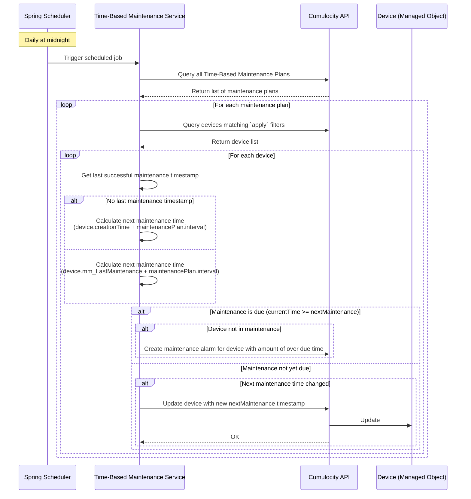

# ADR-001: Time-Based Trigger Implementation for Maintenance Plans

## Status
Implemented (Updated to use cron expressions)

## Context
The Cumulocity Maintenance Module requires a mechanism to trigger maintenance tasks based on scheduled time patterns. The `TimeBasedTrigger` model has been updated to use cron expressions instead of ISO 8601 duration intervals to provide more flexibility for scheduling maintenance at specific times and days.

- Monitors all devices with time-based maintenance plans
- Calculates the next execution timestamp for each device using cron expressions
- Triggers maintenance tasks at the appropriate scheduled time
- Scales to handle potentially thousands of devices
- Integrates seamlessly with the Cumulocity IoT platform
- Handles edge cases such as service restarts, missed executions, and timezone considerations

Cron expressions support flexible scheduling patterns including:
- Specific times: `0 9 * * 1` (every Monday at 9:00 AM)
- Daily patterns: `0 0 12 * * *` (every day at noon)
- Monthly patterns: `0 0 0 1 * *` (first day of every month at midnight)
- Weekly patterns: `0 0 0 * * 5` (every Friday at midnight)
- Complex patterns: `0 0 9-17 * * 1-5` (every weekday from 9 AM to 5 PM)

## Decision Drivers
- **Scalability**: Must handle hundreds to thousands of devices efficiently
- **Reliability**: Must not miss scheduled maintenance executions
- **Accuracy**: Day-level precision is sufficient for industrial IoT maintenance plans
- **Resource Efficiency**: Minimize CPU, memory, and API call overhead
- **Maintainability**: Solution should be easy to understand, test, and debug
- **Cumulocity Integration**: Leverage platform capabilities where appropriate
- **Recovery**: Handle service restarts and failures gracefully

## Options Considered

### Option 1: Periodic Job with Timestamp Calculation (Proposed Approach)

**Description:**
A scheduled job runs daily, queries all devices with time-based maintenance plans, calculates if maintenance is due, and triggers execution if the next execution timestamp has passed.

**Implementation Details:**

Initialalize:
- Set last successful maintenance timestamp manually or or default with maintenance plan start time

Schedule job:
- Spring Boot `@Scheduled` task runs once per day (e.g., at midnight or configured time)
- The maintenance module microservice is multitenant capable, so for each tenant in parallel the job should run. See template: https://github.com/Cumulocity-IoT/cumulocity-microservice-templates/tree/main/multischeduler
- Query Cumulocity for all devices with time-based maintenance plans using `apply` filters
- For each device, calculate next execution time based on:
  - Last successful maintenance timestamp (stored in Cumulocity)
  - Cron expression from maintenance plan
- Store next maintenance timestamp back to Cumulocity if this has changed
- If current time >= next maintenance time and device not in maintenance: create maintenance alarm

## Sequence Diagram

Start maintenance:
- Create start maintenance event
- Set maintenance alarm to acknowledged
- Set device to maintenance mode

Finish maintenance:
- Create finish maintenance event
- Set maintenance alarm to cleared
- Set device to normal mode
- Update last successful maintenance timestamp

**Pros:**
- Simple to implement and understand
- Easy to debug and monitor
- Predictable resource usage
- Minimal API calls to Cumulocity (once per day)
- Works well with Cumulocity's REST API patterns
- Service restarts are handled naturally (timestamps persist)
- No additional infrastructure required
- Reduced resource consumption compared to frequent polling

**Cons:**
- Timing granularity limited to daily execution
- Maintenance tasks triggered once per day (not suitable for sub-day precision requirements)
- May miss executions if job takes longer than 24 hours
- All daily maintenance tasks triggered at similar time (potential load spike)

**Storage Options:**
- **Managed Object Fragment**: Add custom fragment `c8y_maintenanceSchedule` with `lastExecution` and `nextExecution` timestamps
- **Event**: Create events for each execution (good for audit trail, but querying might be slower)
- **Operation**: Store as custom operation with status and timestamps
- **Measurement**: Use measurements series (non-standard approach)

### Option 2: Individual Scheduled Tasks per Device

**Description:**
Create a dynamic scheduled task for each device with time-based maintenance. Each device gets its own timer that triggers at the exact calculated time.

**Implementation Details:**
- Use Spring's `TaskScheduler` to create dynamic scheduled tasks
- On service startup, load all devices and schedule individual tasks
- Each task calculates its own next execution and reschedules itself
- Store task references in memory or distributed cache

**Pros:**
- Precise timing for each device
- No unnecessary polling or queries
- More efficient resource usage at scale
- Can handle very short intervals

**Cons:**
- Complex to implement and manage
- Difficult to handle service restarts (need to rebuild all schedules)
- Memory overhead with thousands of devices
- Challenging to monitor and debug individual tasks
- Risk of memory leaks if tasks aren't properly cleaned up
- Synchronization issues in clustered deployments

### Option 3: Cumulocity Smart Rules / CEP Engine

**Description:**
Leverage Cumulocity's built-in Complex Event Processing (CEP) or Smart Rules to trigger maintenance based on time conditions.

**Implementation Details:**
- Create smart rules that monitor time intervals
- Use Cumulocity's scheduler module if available
- Trigger maintenance operations through platform mechanisms

**Pros:**
- Native platform integration
- Leverages Cumulocity's proven scalability
- No custom scheduling code required
- Platform handles failures and restarts

**Cons:**
- Limited to Cumulocity's CEP capabilities
- May not support complex ISO 8601 intervals
- Less control over timing logic
- Potential licensing or feature availability constraints
- Harder to customize for specific requirements
- Dependency on platform features that may change

### Option 4: Distributed Job Scheduler (e.g., Quartz, Kubernetes CronJobs)

**Description:**
Use a robust distributed job scheduling framework to manage time-based triggers.

**Implementation Details:**
- Integrate Quartz Scheduler with database persistence
- Create dynamic jobs for each device's maintenance schedule
- Use Quartz's clustering support for high availability
- Or use Kubernetes CronJobs for cloud-native deployment

**Pros:**
- Enterprise-grade scheduling capabilities
- Built-in clustering and high availability
- Persistent job storage
- Advanced features (misfire handling, job priorities)
- Well-tested and documented

**Cons:**
- Additional infrastructure complexity
- External database required for Quartz clustering
- Overkill for simple time-based triggers
- Learning curve for team
- Increased deployment complexity
- Potential licensing considerations

### Option 5: Event-Driven with Message Queue

**Description:**
Use a message queue (e.g., Kafka, RabbitMQ) with delayed message delivery to schedule maintenance triggers.

**Implementation Details:**
- After maintenance execution, calculate next execution time
- Publish delayed message to queue with calculated delay
- Consumer processes messages and triggers maintenance
- Re-publish next delayed message after execution

**Pros:**
- Highly scalable and distributed
- Natural decoupling of components
- Built-in reliability and persistence
- Supports event-driven architecture

**Cons:**
- Requires message broker infrastructure
- Complex setup and operational overhead
- Overkill for this use case
- Not all message brokers support delayed delivery well
- Difficult to modify scheduled times dynamically
- Additional point of failure

## Decision
**[To be decided after evaluation]**

Currently recommending **Option 1: Periodic Job with Timestamp Calculation** with the following refinements:

1. **Storage Strategy**: Use Managed Object Fragments
   - Store `c8y_maintenanceSchedule` fragment containing:
     - `lastExecutionTime`: ISO 8601 timestamp
     - `nextExecutionTime`: ISO 8601 timestamp (calculated from cron)
     - `cronExpression`: Cron expression for scheduling
     - `status`: "ACTIVE", "PAUSED", "ERROR"

2. **Optimization**: Implement query optimization
   - Query only active maintenance plans
   - Use Cumulocity inventory query filters
   - Consider pagination for large result sets

3. **Timing Precision**: Daily execution is appropriate
   - Maintenance intervals for industrial IoT are typically measured in days, weeks, or months
   - Day-level precision is sufficient for maintenance planning
   - Aligns with real-world maintenance workflows and operations
   - Significantly reduces resource consumption and API calls

4. **Scaling Strategy**: 
   - Monitor job execution time
   - If approaching 24 hours, implement batching or parallel processing
   - Daily execution provides ample time for processing even large device fleets
   - Consider staggered execution or time-window spreading if needed

## Consequences

### Positive
- Quick to implement and deliver value
- Easy for team to understand and maintain
- Minimal infrastructure requirements
- Fits naturally with existing Spring Boot architecture
- Timestamps provide clear audit trail
- Service restarts handled gracefully
- Very low resource consumption (runs once per day)
- Minimal API calls to Cumulocity platform

### Negative
- Fixed daily granularity may not suit sub-day precision requirements (if they arise)
- All maintenance tasks triggered at similar time may cause load spikes
- Need to monitor execution time as device count grows
- Cannot support maintenance intervals shorter than one day

### Neutral
- May need to evolve to Option 2 or 4 if requirements change significantly
- Trade-off between simplicity and precision is intentional
- Performance monitoring will guide future iterations

## Assumptions
- Maintenance intervals are typically measured in hours, days, or weeks (not seconds)
- Device count will not exceed thousands in near-term deployments
- Cumulocity API performance is sufficient for periodic queries
- Network latency to Cumulocity is acceptable (< 1 second)
- Service restarts are infrequent

## Risks
- **Scalability Limit**: May hit performance ceiling with > 10,000 devices
  - Mitigation: Implement pagination and query optimization early
- **Timing Drift**: Cumulative delays could cause execution drift
  - Mitigation: Calculate next execution from absolute time, not relative
- **Job Overlap**: If job takes > 24 hours, could cause overlapping executions
  - Mitigation: Implement execution locking/mutex pattern (unlikely with daily execution and reasonable device counts)
- **Missed Executions**: Service downtime could miss scheduled maintenance
  - Mitigation: On startup, check for overdue maintenance and execute

## Implementation Notes
- Use Spring's `@Scheduled(cron = "0 0 0 * * ?")` for daily execution at midnight (configurable)
- Implement proper error handling and logging
- Add metrics for monitoring (execution time, device count, failures)
- Consider using `@Async` for parallel device processing
- Implement circuit breaker pattern for Cumulocity API calls
- Use Spring CronExpression class for parsing and calculating next execution times
- Add configuration properties for job interval (externalize the 1-minute value)
- Validate cron expressions at maintenance plan creation time

## Related Decisions
- [Link to ADR about Managed Object structure]
- [Link to ADR about error handling strategy]
- [Link to ADR about monitoring and observability]

## References
- Cron Expression Format: https://en.wikipedia.org/wiki/Cron
- Spring CronExpression: https://docs.spring.io/spring-framework/docs/current/javadoc-api/org/springframework/scheduling/support/CronExpression.html
- Spring Scheduling: https://docs.spring.io/spring-framework/docs/current/reference/html/integration.html#scheduling
- Cumulocity REST API: https://cumulocity.com/guides/reference/rest-implementation/
- TimeBasedTrigger Model: `src/main/java/cumulocity/microservice/maintenancemodule/model/TimeBasedTrigger.java`

## Review History
| Date | Reviewer | Decision | Notes |
|------|----------|----------|-------|
| 2026-01-19 | - | Proposed | Initial draft |
| 2026-01-29 | - | Updated | Changed from ISO 8601 intervals to cron expressions for more flexible scheduling |

---

**Author**: APES  
**Date**: 2026-01-19  
**Version**: 1.1  
**Last Updated**: 2026-01-29
